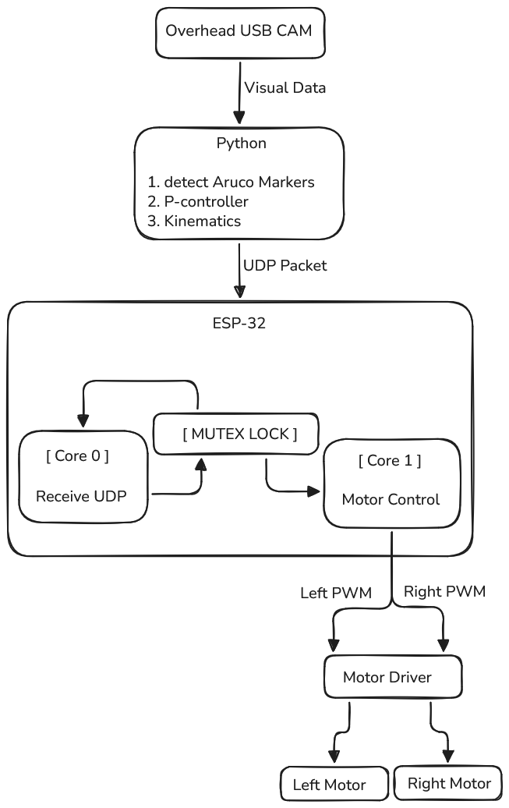

# Overhead ArUco Robot Navigation

Overhead webcam tracks a differential-drive robot via ArUco markers and autonomously drives it to a floor target marker. All vision and kinematics run on the PC; commands are sent to an ESP32 over WiFi UDP.

---

## System Overview

<p align="center">
  
</p>

*Figure: System architecture

---

## ArUco Markers

| Role   | ID | Dictionary |
|--------|----|------------|
| Robot  | 1  | 4X4_50     |
| Target | 0  | 4X4_50     |

Print from: **https://chev.me/arucogen/**  
- Dictionary: `4X4_50`  
- Recommended size: **10 cm**  
- Place robot marker flat on top of robot, target marker flat on the floor.

---

## Hardware

| Component | Notes |
|-----------|-------|
| ESP32 DevKit | any variant with WiFi |
| L298N dual H-bridge | or L293D |
| 2× DC motors | differential drive |
| Overhead USB webcam | 1280×720 minimum |
| PC | runs Python vision loop |

### L298N Wiring (default pins — change in `.ino`)

| Signal    | ESP32 GPIO |
|-----------|-----------|
| LEFT IN1  | 27 |
| LEFT IN2  | 26 |
| LEFT ENA  | 14 |
| RIGHT IN1 | 25 |
| RIGHT IN2 | 33 |
| RIGHT ENB | 32 |

---

## Repository Structure

```
.
├── robot_control_pc.py       # PC vision + kinematics + UDP sender
├── esp32_robot/
│   └── esp32_robot.ino       # ESP32 Arduino sketch
└── README.md
```

---

## PC Setup

```bash
pip install opencv-contrib-python numpy
```

> `opencv-contrib-python` is required for ArUco support.

---

## Configuration

### `robot_control_pc.py` — top of file

```python
# ArUco IDs
ROBOT_MARKER_ID  = 1
TARGET_MARKER_ID = 0

# Network
ESP32_IP   = "192.168.4.1"   # default ESP32 AP IP
ESP32_PORT = 4210

# Robot physical parameters
WHEEL_RADIUS = 0.033    # metres
WHEEL_BASE   = 0.16     # metres (wheel-to-wheel distance)
MAX_RPM      = 150

# Pixel-to-metre calibration
PIXEL_TO_METRE = 0.001  # measure a known distance in camera view to calibrate

# Control gains
LINEAR_KP  = 0.4
ANGULAR_KP = 1.8
```

### `esp32_robot.ino` — top of file

```cpp
const char* SSID     = "RobotAP";
const char* PASSWORD = "robot1234";
const int   UDP_PORT = 4210;

// Physical (must match PC)
const float WHEEL_RADIUS = 0.033f;
const float WHEEL_BASE   = 0.16f;
const float MAX_OMEGA    = 15.7f;   // rad/s ≈ 150 RPM

// Loop rates
const int UDP_HZ   = 50;    // UDP receive rate
const int MOTOR_HZ = 100;   // motor update rate
```

---

## Kinematics

### Forward Kinematics

Given wheel angular velocities ω_L, ω_R (rad/s):

```
v = (ω_R + ω_L) × r / 2
w = (ω_R − ω_L) × r / L
```

- `r` = wheel radius  
- `L` = wheel base  
- `v` = robot linear velocity (m/s)  
- `w` = robot angular velocity (rad/s)

### Inverse Kinematics

Given desired `v` and `w`:

```
v_L = v − (w × L / 2)
v_R = v + (w × L / 2)
ω_L = v_L / r
ω_R = v_R / r
```

Both are clamped to ±MAX_OMEGA.

---

## Running

### 1. Flash ESP32

Open `esp32_robot/esp32_robot.ino` in Arduino IDE.  
Install board: **ESP32 by Espressif** via Board Manager.  
Select your board and port, then Upload.

### 2. Connect the webcam and run Calibration.py 

here run the program Calibration.py, place a scale and write the physical length of the scale and mark 2 points on the 
screen in the running software and press calibrate, paste the value in the robot_control_pc.py

### 3. Connect PC to ESP32 WiFi

```
SSID: RobotAP
Pass: robot1234
```

### 4. Run PC script

```bash
python robot_control_pc.py
```

Press **q** to quit and stop the robot.

---

## Calibration Tips

1. **PIXEL_TO_METRE** — place a ruler in camera view, and run the calibration.py
2. **ANGULAR_KP / LINEAR_KP** — increase if robot is sluggish, decrease if oscillating.
3. **MAX_RPM** — set to your motor's actual no-load RPM for accurate velocity mapping.
4. **Marker orientation** — corner 0→1 edge defines robot "forward". Rotate marker on robot if direction is wrong.

---

## UDP Packet Format

PC → ESP32 (ASCII, newline terminated):

```
L<omega_left>,R<omega_right>\n
```

Example: `L3.14,R2.80\n`  
Values are wheel angular velocities in rad/s (signed).

---

## License

MIT
